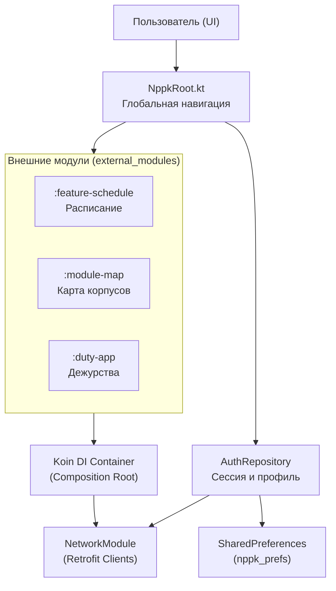

# Архитектура Навигатора НППК

Документ написан для разработчиков и администраторов проекта: чтобы было понятно, из каких модулей состоит приложение, как взаимодействуют части системы и где находятся критические узлы логики.

## Паспорт документа

| Поле | Значение |
| --- | --- |
| Проект | Навигатор НППК, Android-клиент |
| Назначение | Агрегатор сервисов колледжа: расписание, навигация, дежурства и профиль |
| Основной стек | Kotlin, Jetpack Compose, Koin (DI), Retrofit 2, Coroutines, Flow |
| Основной исполняемый проект | `:app` |
| Внешние модули | `external_modules/` (Schedule, Map, DutySchedule) |
| Серверная зависимость | NPPK API (два независимых сервера: 8000 и 8081) |

## Кратко

Приложение построено по принципу **Modular Monolith** с элементами **Clean Architecture**.

Первый слой — **App-хост** (`:app`). Это "умная" оболочка. Она отвечает за авторизацию, хранение сессии, переключение глобальных тем и навигацию между крупными блоками. Именно здесь настраивается сеть (Retrofit) и внедряются зависимости (Koin).

Второй слой — **Функциональные модули** (`external_modules/*`). Это изолированные "приложения внутри приложения". Они не знают друг о друге напрямую. Когда приложению нужно показать расписание, хост "надувает" экран из модуля Schedule, передавая ему настроенные инструменты для работы с сетью.

## Общая схема

## Основные компоненты

| Компонент | Основные файлы | Что делает |
| --- | --- | --- |
| Точка входа | `NPPKApp.kt`, `MainActivity.kt` | Инициализирует Koin, настраивает SplashScreen и запускает главный контейнер. |
| Главный экран | `NppkRoot.kt` | Управляет состоянием авторизации (`AuthMode`) и Bottom Navigation. |
| Сетевой слой | `data/di/NetworkModule.kt` | Создает два именованных клиента Retrofit для разных серверов API. |
| Авторизация | `AuthRepositoryImpl.kt`, `AuthApi.kt` | Выполняет вход, получает ФИО и группу, сохраняет сессию на диск. |
| Модуль Расписания | `ScheduleModuleScreen.kt`, `MainTestScreen.kt` | Отображает пары. Имеет встроенное разграничение "Студент/Преподаватель". |
| Модуль Карты | `MapModuleScreen.kt` | Напрямую "надувает" XML-слой модуля Map и управляет WebView для SVG-карт. |
| Безопасность | `AuthRepository.kt` | Проверяет роли и ограничивает доступ к административным кнопкам. |

## Как запускается приложение

1. Android запускает `NPPKApp.kt`.
2. `startKoin` регистрирует модули всех фич и настраивает `BASE_URL`.
3. `MainActivity` проверяет настройки темы и запускает `NppkMainContent`.
4. `NppkRoot` вызывает `authRepository.isLoggedIn()`.
5. Если данные в `SharedPreferences` есть, пользователь сразу видит Расписание.
6. Если сессии нет — открывается `LoginScreen`.

## Где хранится состояние

| Что хранится | Где искать | Комментарий |
| --- | --- | --- |
| Сессия пользователя | `SharedPreferences ("nppk_prefs")` | Поля `is_logged_in`, `user_id`, `user_role`. |
| Профиль | `AuthRepositoryImpl` (поле `currentUser`) | Кэшируется в памяти после входа или загрузки из префсов. |
| Настройки темы | `nppk_prefs` (ключ `dark_theme_enabled`) | Сохраняется мгновенно через `apply()`. |
| Подписки (учителя) | `TeacherPreferencesRepository` | JSON-файл во внутреннем хранилище модуля Schedule. |

## Безопасность

1. **Разграничение ролей**: Студент не может вызвать "Режим учителя", так как кнопка скрыта на уровне кода UI через проверку `getCachedRole()`.
2. **Изоляция сети**: Учетные данные пользователя передаются только на `GroupRetrofit` (порт 8081).
3. **Целостность данных**: Для сохранения критических данных (ID пользователя при входе) используется `commit()` вместо `apply()`, чтобы избежать потери данных при внезапном закрытии.

## Правила изменения кода

1. **Новый эндпоинт**: Добавляется в `AuthApi.kt`, если он на порту 8081, или в `ScheduleApi.kt`, если на 8000.
2. **Новая зависимость**: Если объект нужен всему приложению, регистрируем в `DataModule.kt`, если только одной фиче — в модуле этой фичи.
3. **UI**: Все цвета и шрифты брать ТОЛЬКО из `ScheduleTheme.colors`, никакой хардкод-палитры.
4. **Сборка**: Перед пушем всегда делать `./gradlew assembleDebug`.
